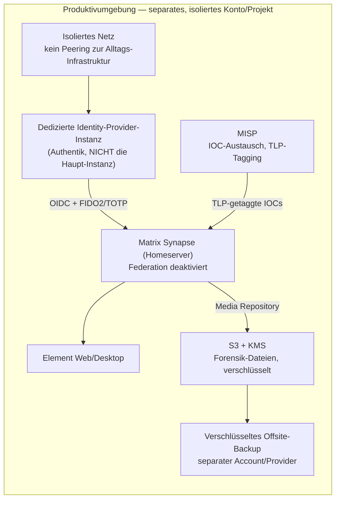

# Architektur-Empfehlung

## Kernfrage: reicht eine einzelne EC2-Instanz?

**Nein**, nicht für den produktiven Out-of-Band-Betrieb. Laut AWS' eigener Sicherheits-Dokumentation (siehe [01-analyse-und-quellen.md](01-analyse-und-quellen.md)) ist die empfohlene Architektur für Forensik-/IR-Workloads ein **separater, dedizierter AWS-Account** (eigene Organisationseinheit) mit einer **vollständig isolierten, restriktiven, auditierbaren VPC** — nicht eine einzelne Instanz im bestehenden Produktiv-Account. Der Grund: Wenn der Hauptaccount/das Hauptnetz kompromittiert ist, darf die IR-Kommunikationsplattform davon nicht mit betroffen sein.

Für einen **Proof-of-Concept** (Software-Evaluierung, UX-Test, 2FA-Flow-Test) ist eine einzelne isolierte VM dagegen völlig ausreichend — siehe [03-poc-anleitung.md](03-poc-anleitung.md).

## Empfohlener Software-Stack

### Warum dieser Stack

- **Matrix/Synapse + Element**: einzige im Research mit verifiziertem, auditierbarem E2EE-Vertrauensmodell (Cross-Signing, siehe [01-analyse-und-quellen.md](01-analyse-und-quellen.md)). Self-hosted, aktiv gepflegt. **Federation muss deaktiviert werden** — sonst ist der Homeserver nicht wirklich isoliert.
- **Identity-Provider davor statt Matrix-eigener Auth**: Synapse unterstützt OIDC-Provider nativ (`oidc_providers` in `homeserver.yaml`), moderner über das Matrix Authentication Service (MAS) Projekt. Damit läuft 2FA/FIDO2-Erzwingung zentral im IdP — Chat-Layer und Auth-Layer bleiben sauber getrennt.
- **Eigene, separate IdP-Instanz für die IR-Plattform**: NIST SP 800-63B schließt E-Mail als Out-of-Band-Auth-Kanal aus; dieselbe Logik gilt für den IdP selbst — die IR-Plattform sollte nicht denselben Identity-Provider-Client/Flow wie die alltägliche Infrastruktur nutzen, damit ein Incident dort den IR-Zugang nicht mit invalidiert.
- **MISP für IOC/strukturierten Datenaustausch statt Chat-Anhänge**: strukturierte Daten (Logs, IOCs) gehören nicht als Datei in den Chat, sondern in eine IOC-Plattform mit TLP-Tag und STIX-Export — sauberer Audit-Trail, automatische Korrelation.
- **S3 mit KMS statt Chat-eigenem Storage** für große Forensik-Artefakte: kurzlebige Zugriffs-Credentials, Encryption-at-Rest mit Customer-Managed Keys, TLS-Erzwingung (siehe AWS-Framework in [01-analyse-und-quellen.md](01-analyse-und-quellen.md)). Bei bereits vorhandenem AWS-Account: natives S3 nutzen statt selbst gehosteten Object-Storage zu betreiben — spart Betriebsaufwand. **MinIO explizit nicht mehr empfohlen** (siehe [05-lizenzen-und-limits.md](05-lizenzen-und-limits.md)): Projekt seit Dezember 2025 in "Maintenance Mode", Community Edition verlor bereits im Mai 2025 die Admin-Konsole zugunsten des Enterprise-Tarifs. Bei Bedarf für providerunabhängigen Self-Hosted-Object-Storage stattdessen Ceph oder SeaweedFS prüfen (nicht Teil dieser Recherche).
- **Kein CryptPad, kein ArmorText als Kernkomponente**: beide hatten unbelegte bzw. widerlegte Sicherheitsaussagen bei der Verifikation (siehe Abschnitt 2 in [01-analyse-und-quellen.md](01-analyse-und-quellen.md)). CryptPad kann optional ergänzend für unkritische Notizen genutzt werden, aber nicht als tragende Sicherheitsschicht ohne eigene unabhängige Prüfung.

## TLP-Integration

TLP (Traffic Light Protocol, aktuell Version 2.0) kennzeichnet nur die Sensitivität von geteilten Informationen — es ist **kein** Verschlüsselungs- oder Zugriffskontrollstandard (siehe [01-analyse-und-quellen.md](01-analyse-und-quellen.md)). Empfohlene Umsetzung:

- Matrix-Räume mit TLP-Präfix benennen (z.B. `TLP:AMBER — Incident-2026-XX`)
- MISP-Events/Attribute mit TLP-Tags versehen (MISP unterstützt das nativ, siehe CIRCL-Best-Practices)
- Tatsächlicher Zugriffsschutz kommt aus E2EE + IdP-Zugriffskontrolle, nicht aus dem TLP-Label selbst

## AWS EC2 vs. Alternativen

| Kriterium | AWS EC2 (eu-central-1) | Separates Cloud-Projekt bei einem EU-Anbieter (z.B. Hetzner Cloud) |
|---|---|---|
| DSGVO/EU-Datenresidenz | ✅ erfüllt | ✅ erfüllt (bei EU-Rechenzentrum) |
| Konto-/Netz-Isolation vom Hauptbetrieb | ✅ möglich (separater Account/OU) | ✅ möglich (separates Projekt/Konto) |
| Laufende Kosten im Dauerbetrieb | tendenziell höher | tendenziell deutlich günstiger |
| AWS-natives Tooling (KMS, STS, CloudTrail) | ✅ vorhanden, gut dokumentiert (siehe Quellen) | äquivalente Bordmittel meist selbst zu konfigurieren |
| Vendor-Lock-in | AWS-spezifisch | anbieterabhängig, meist offener |

**Einschätzung:** AWS EC2 ist technisch machbar und die AWS-eigenen Sicherheits-Frameworks (Konto-Isolation, STS, KMS) sind gut dokumentiert und produktionsreif. Für eine Organisation, die **bereits** an einen anderen europäischen Cloud-Anbieter gebunden ist, ist ein zusätzliches, komplett getrenntes Projekt bei diesem Anbieter eine ernstzunehmende, meist günstigere Alternative bei gleicher DSGVO-Konformität — vorausgesetzt, es besteht kein expliziter Zwang zu AWS (z.B. durch Kunden-/Partnervorgaben oder AWS-spezifisches Tooling).

⚠️ **Kosten-Hinweis:** Die im Research gefundenen Kostenvergleichs-Quellen (Blog-Artikel) erreichten nicht die Qualitätsschwelle für eine verifizierte Aussage und werden hier bewusst **nicht** als belastbare Zahl zitiert. Für eine reale Kostenkalkulation: eigene Preisrechner (AWS Pricing Calculator, jeweiliger EU-Anbieter) mit konkretem Instanztyp/Storage-Volumen nutzen.

## Wichtige Sicherheitsrisiken und Fallstricke

- **Schlüsselverwaltung**: Cross-Signing-/Recovery-Keys der Nutzer müssen sicher hinterlegt sein (Passphrase getrennt vom Account verwahren). Die Sicherheit von Matrix' server-seitigem Secret-Storage (SSSS) konnte in der Recherche **nicht** verifiziert werden (siehe widerlegte Aussagen) — vor Produktivnutzung eigenständig prüfen.
- **2FA-Geräteverlust**: Ein Recovery-Prozess für verlorene MFA-Geräte muss VOR dem Ernstfall definiert sein (Break-Glass-Zugang mit Hardware-Key an sicherem Ort).
- **Metadaten-Leaks**: Auch mit Ende-zu-Ende-Verschlüsselung sieht der Server, wer mit wem wann kommuniziert. Bei hochsensiblen Incidents Raum-/Kanalnamen möglichst neutral halten.
- **Federation**: unbedingt deaktivieren, sonst ist der Homeserver kein wirklich isoliertes System.
- **DDoS/öffentliche Erreichbarkeit**: Falls die Plattform öffentlich erreichbar sein muss (externe IR-Partner), einen DDoS-Schutz vorschalten statt die Instanz direkt zu exponieren.
- **TLP ≠ Zugriffsschutz**: TLP kennzeichnet Sensitivität, schützt aber nicht technisch — siehe oben.
- **Backup-Schlüsselverwaltung**: Verschlüsselungsschlüssel für Backups getrennt vom System aufbewahren, sonst ist das Backup bei Totalverlust nutzlos.
