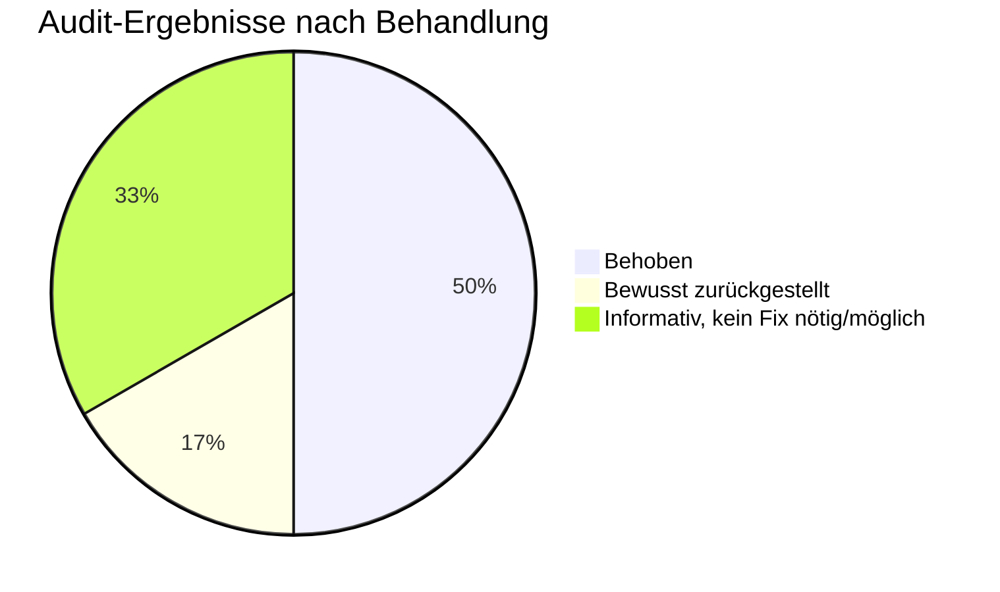
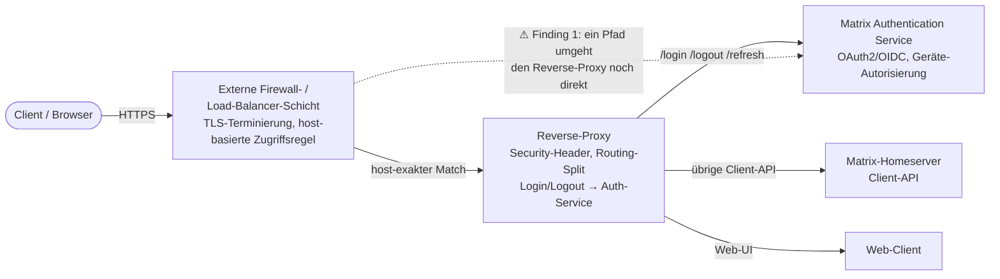

# Security-Audit und Härtung

Nach der Produktivsetzung des POC mit externen Testnutzern (siehe [06-mas-migration-und-qr-login.md](06-mas-migration-und-qr-login.md)) wurde ein gezielter Security-Check des laufenden Setups durchgeführt — kein Code-Review, sondern eine Live-Prüfung der tatsächlich aktiven Konfiguration plus Versionsabgleich gegen aktuelle CVE-/Advisory-Quellen.

## Methodik

- **Versionsabgleich**: alle eingesetzten Kernkomponenten (Homeserver, Auth-Service, Web-Client, Identity-Provider, vorgeschaltete Netzwerkschicht) gegen aktuelle CVE-Datenbanken und Hersteller-Security-Advisories geprüft.
- **Live-Konfigurationsprüfung statt Dokumentenprüfung**: Netzwerk-Exposure der Dienste direkt getestet (welche Ports sind von wo erreichbar), Dateiberechtigungen auf Secrets-Dateien geprüft, tatsächliche HTTP-Response-Header und TLS-Konfiguration gegen die öffentliche Domain verifiziert — nicht nur die Soll-Konfiguration gelesen.

## Ergebnis Versionsabgleich

| Komponente | CVE-Status zum Auditzeitpunkt |
|---|---|
| Matrix-Homeserver (Synapse) | Aktuell, alle historisch bekannten CVEs liegen deutlich vor der eingesetzten Version |
| Matrix Authentication Service | Keine bekannte relevante CVE |
| Element Web | Keine bekannte relevante CVE |
| Authentik (Identity Provider) | Bereits auf einem Patch-Stand, der die 2026 bekannt gewordenen Auth-Bypass-CVEs (Source-Stage-Bypass, Proxy-Provider-Bypass) schließt |
| Vorgeschaltete Firewall-/Load-Balancer-Schicht | Ein 2026 veröffentlichter authenticated-RCE-Fund wird vom Hersteller bewusst nicht gepatcht ("erwartetes Verhalten für bereits authentifizierte Administratoren"). Betrifft nur, wer bereits gültige Admin-Zugangsdaten für diese Schicht besitzt — kein plattformspezifisches Risiko, wird aber beobachtet. |

Ein zunächst als Treffer erscheinender 2026er Auth-Bypass-CVE für einen alternativen, in Rust geschriebenen Matrix-Homeserver wurde geprüft und als **nicht zutreffend** verworfen — die hier eingesetzte Referenzimplementierung ist davon nicht betroffen.

## Gefundene Konfigurationsschwachstellen

| # | Finding | Schwere | Status |
|---|---|---|---|
| 1 | Backend-Dienste (Homeserver, Auth-Service, Web-Client) direkt aus dem internen Netz erreichbar, nicht nur über den Reverse-Proxy | Hoch | **Zurückgestellt** — einer der externen Zugriffspfade routet aktuell direkt auf einen Backend-Port; Auflösung erfordert eine koordinierte Anpassung von Port-Bindung und externem Routing |
| 2 | Konfigurationsdateien mit Secrets (Client-Secret, DB-Zugangsdaten, Signing-Keys) waren world-readable | Hoch | **Behoben** — auf owner-only-Zugriff eingeschränkt |
| 3 | Keine modernen Security-Header (HSTS, Anti-Clickjacking, MIME-Sniffing-Schutz, CSP) auf der öffentlichen Domain | Mittel | **Behoben** |
| 4 | Vertrauensliste für Proxy-Header im Auth-Service viel zu weit gefasst (komplette private Adressräume statt des tatsächlichen Reverse-Proxy-Pfads) | Niedrig-Mittel | **Behoben** |
| 5 | Kein host-eigenes Rate-Limiting/Brute-Force-Schutz auf dem POC-Host selbst | Niedrig | Informativ — durch den vorgeschalteten Identity-Provider (eigenes Reputation-/Rate-Limiting) mitigiert |
| 6 | Unauthenticated-Angriffsfläche der vorgeschalteten Firewall-/Load-Balancer-Schicht | Informativ | Kein POC-spezifisches Risiko, siehe Tabelle oben |

## Anfrage-Fluss nach der Härtung

## Lessons Learned

- **Container-interner User vor dem Setzen restriktiver Dateiberechtigungen prüfen**: Der erste Versuch, die Secrets-Datei des Auth-Service auf reinen Owner-Zugriff zu setzen, hat den Dienst kurzzeitig in eine Neustart-Schleife geschickt ("Permission denied"), weil der Container-Prozess unter einer nicht-root-UID läuft, die Datei aber `root:root` gehörte. Fix: Owner der Datei auf die tatsächliche Container-Laufzeit-UID setzen, nicht pauschal auf `root`.
- **Docker-Port-Publishing bindet standardmäßig an alle Netzwerk-Interfaces**: Wer einen Dienst nur für einen lokal auf demselben Host laufenden Reverse-Proxy erreichbar machen will, muss das Port-Binding explizit auf `localhost` einschränken — sonst ist der Dienst für das gesamte interne Netzsegment offen erreichbar und umgeht jede am Reverse-Proxy implementierte Schutzschicht (Header, Routing-Beschränkungen).
- **Bei Docker-Bridge-Netzen kommt Traffic vom Host selbst nicht als `127.0.0.1` beim Container an**: Durch Hairpin-NAT sieht der Container die IP des Docker-Bridge-Gateways. Eine Vertrauensliste für Proxy-Header muss diese Gateway-Adresse statt eines pauschalen "localhost"-Eintrags berücksichtigen.

## Offene Punkte

- Finding 1 (direkte Erreichbarkeit der Backend-Ports) ist bewusst noch nicht behoben — die Auflösung hängt an einer Anpassung des externen Routings für einen der beiden Zugriffspfade und wird als nächster Schritt eingeplant.
- Kein host-eigenes Rate-Limiting auf dem POC-Host (Finding 5) — aktuell für den POC-Maßstab als ausreichend mitigiert bewertet, für die spätere Produktivumgebung (siehe [02-architektur.md](02-architektur.md)) nachzuschärfen.
